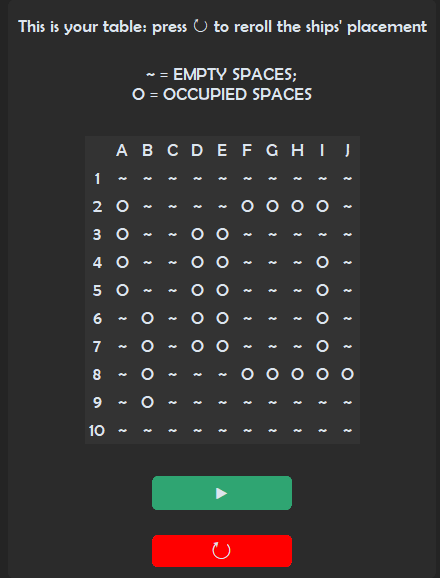
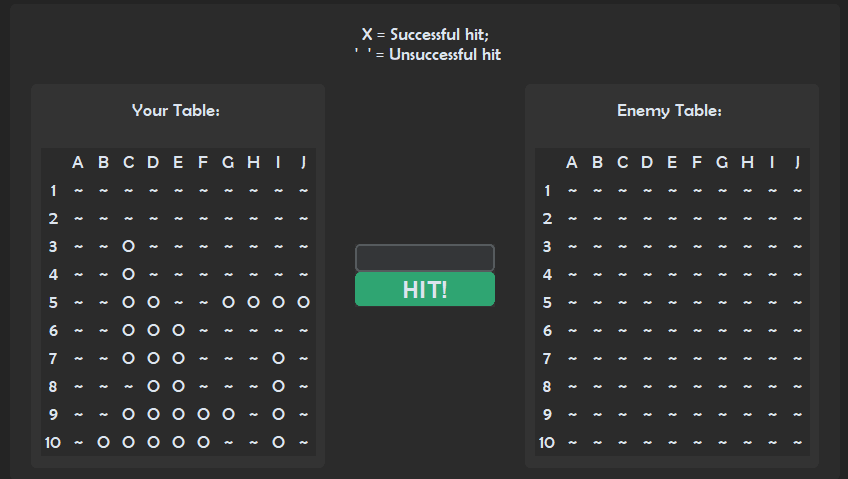

# Battleship

This python program allows the user to play the notorious board game "Battleship" against the computer in 4 different difficulties: Easy, Medium, Hard and Hell. The game features sound effects took from the internet and background music generated by [Beatoven AI](https://www.beatoven.ai), alongside a simple Error Logging system.

## Table of Contents

- [Getting Started](#Getting-Started)
- [Usage](#Usage)
- [Authors](#Authors)

## Getting Started

DISC requires the presence of customtkinter and pygame on the system. To install them you want to run from the terminal the following commands:
- `pip install customtkinter` ;
- `pip install pygame` .

## Usage

Battleship is a GUI provided application. After starting it up you will be asked to choose a difficulty and provided the chance to change the app's theme before the game starts. 

Unfortunately the game does not provide a way to effectively place ships the way you would like to. However a ship placement configuration will be randomly generated for you and you will be asked if you want to keep it that way or change it.

The game will start with your turn: 

In the central part of the screen you will have to input the coordinates in which you want to hit your opponent. The moment one board has no more ships on it the game will end, you will be shown the result of the match and asked if you want to play again.

## Authors

- [LorenBll](https://github.com/LorenBll) ;
- Maurizio (the link to his GitHub profile is unavailable) .